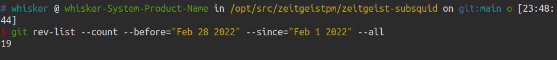
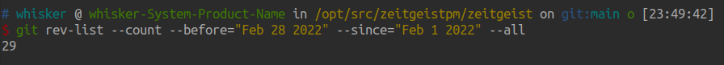
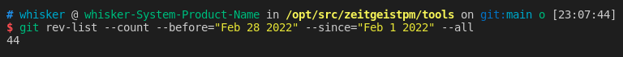

# Monthly Report #202202

## Tech

### Subsquid 集成

本月继续将 Subsquid 集成到 Zeitgeist 生态中，将 Subsquid 作为 Zeitgeist 中重要的数据索引工具，总计提交了 19 份 commits。下面是关键更新详情：

- 支持批处理外部调用购买全集的解析（[#58](https://github.com/zeitgeistpm/zeitgeist-subsquid/commit/6ad6cf11b5eba6b6c5348830173a8c1834715cfb?diff=split)）
- 设置资产历史价格追踪：
  - 阶段性资产价格追踪，并支持在市场创建时资产的创建（[#61](https://github.com/zeitgeistpm/zeitgeist-subsquid/commit/b6cd929e49b6e9e6f1f32b9174f023cfe9398e01)）
  - 在资产池创建时初始化现货价格（[#62](https://github.com/zeitgeistpm/zeitgeist-subsquid/commit/4687ce1aa8a3f113c5572994d909ca16e22eebc9)）
  - 在 Swap 的过程中支持历史资产价格记录（[#70](https://github.com/zeitgeistpm/zeitgeist-subsquid/commit/ea40d14936e6ba1ef79623cd1a0505d3a60fdb68)）
  - 增加加入与退出资产池事件的 handler 并支持历史资产价格记录（[#73](https://github.com/zeitgeistpm/zeitgeist-subsquid/commit/6c7acc17394523819d8d6655eee36badffc18ed4)）
- 支持资产池创建时权重的分配（[#64](https://github.com/zeitgeistpm/zeitgeist-subsquid/commit/0bd6cc557ef597ebb95d15c0997e349b3934d390)）
- 针对 Graphql 中对于后端数据库的多对一关系所造成的负载进行解构优化（[#74](https://github.com/zeitgeistpm/zeitgeist-subsquid/commit/d9de28acb82064ca906152eabd6c2e5df217720a)）
- 创建市场历史功能，并更新事件 handler（[#75](https://github.com/zeitgeistpm/zeitgeist-subsquid/commit/f4ce1a8ed98b97c527065f79325d490ebab252d8)）
- 增加资产池增加交易容量(`volume`)字段（[#76](https://github.com/zeitgeistpm/zeitgeist-subsquid/commit/3adc2bf12e7fdc8fe6eb777d5a74e395b7ef85e8)）

### 协议

本月 Zeitgeist 协议的改动不多，主要针对 Polkadot 的升级进行同步升级适配，总计提交了 29 份 commits。下面是关键更新详情：

- 将 `ParachainStaking` 运行时的最小被选择候选人增加到 8 人（[#440](https://github.com/zeitgeistpm/zeitgeist/commit/6024c1c5937503fa98d2b0bb3e2994819e9acdc4)）
- 市场被销毁后，提供一个 `MarketDestroyed` 事件以便给其他服务追踪（[#441](https://github.com/zeitgeistpm/zeitgeist/commit/5f0b7f5023a7603896309b3f33b185ca5862d688)）
- 支持命令行根据区块高度或 Hash 来查询格式可直接用于选定区块载入平行链或在中继链上设置平行链的头部的区块头（[#433](https://github.com/zeitgeistpm/zeitgeist/commit/31e519187e0aad2f2c1c4afabaa4dc7c792844a8)）
- 将代码库更新到 polkadot-0.9.12 并完成适配（[#430](https://github.com/zeitgeistpm/zeitgeist/commit/589f23f0c13bc94c2a3dc744d08d05996ff5310d)）
- 将代码库更新到 polkadot-0.9.13 并完成适配；添加要导出的功能标志；添加更新的 pallet_utility 的 WeightInfo（[#449](https://github.com/zeitgeistpm/zeitgeist/commit/1a57c861ed17af6eaabe881e90324934a2a1458b)）
- 将代码库更新到 polkadot-0.9.15-1 并完成适配；修复运行时基准功能（[#457](https://github.com/zeitgeistpm/zeitgeist/commit/dc5cc9fd6db29d484221da2efa0599888227f525)）
- 优化测试示例（[#468](https://github.com/zeitgeistpm/zeitgeist/commit/314b8579d9187d70b746b5ca148b0c509b1ea61d)）

### SDK

本月 SDK 继续快速迭代，版本号从 v0.3.16 迭代到 v0.4.8-alpha.2 ，总计提交了 44 份 commits。下面是关键更新详情：

- 升级到 Zeitgeist-0.2.2-2acbcec 并发布 SDK v0.4.0 版本（[#150](https://github.com/zeitgeistpm/tools/commit/93629aa7e5e2b1f1aaa8412c2ceba1dfa16e6242)）
- 修复部分状态未显示 bug；更新使用资产池数据等获取活动资产；修改获取市场 ID 方式并发布 SDK v0.4.1 版本（[#152](https://github.com/zeitgeistpm/tools/commit/e8daa01bfce61572013313ca3277a6f4f7b690ed)）
- 增加获取未处在终结状态的市场所有资产的能力；将市场 ID 和资产池 ID 添加到活跃资产结果（[#151](https://github.com/zeitgeistpm/tools/commit/39bf83cb5ee208aab1095fd905bbf9d60b0bc4df)）
- 修复搜索没有 slug 的市场时导致的运行时错误（[#153](https://github.com/zeitgeistpm/tools/commit/06d92ad4457ab593bd677dafb7f0c111a3946fd9)）
- 增加过滤市场的计数函数接口；重新支持通过 Polkadot-js api 中输入 ID 查询市场详情并发布 SDK v0.4.3 版本（[#157](https://github.com/zeitgeistpm/tools/commit/6b5fdeeb8a0b93dfac3690ebf41989f5ee1a485c)）
- 将 Rikiddo 类型定义分离（[#160](https://github.com/zeitgeistpm/tools/commit/157ec00bc354a95fb42e415702cb030a320ba0dc)）
- 将查询活动资产更改为仅使用 Subsquid 来进行查询同时还增加了按市场和分页的搜索并发布 SDK v0.4.5 版本（[#163](https://github.com/zeitgeistpm/tools/commit/38625422787d8cf39545423b61fef28a9782c8f4)）
- 增加查询方案鲁棒性，当 Graphql 不可用时使用节点查询并发布 SDK v0.4.6 版本（[#165](https://github.com/zeitgeistpm/tools/commit/21f389ded54e0b5bddd051382cdd40b9017da400)）
- 支持通过 Subsquid 来查询账户余额，通过资产池获取市场以及资产详情，增加按要求查询资产池接口并发布 SDK v0.4.8-alpha.0 版本（[#168](https://github.com/zeitgeistpm/tools/commit/2017b7160edc69a91aee7fa4cfd69a72d37c62a0)）

### APP 优化

本月大部分工作为 APP 的优化设计，目前 APP 还未开源，总计进行了 157 份 commits

### 其他开发

目前团队还在针对下一次大型市场营销活动进行相关网站以及工具的开发，目前还未开源。

## 团队建设

作为波卡生态中唯一的预测市场项目，我们致力于将最好的技术和成果带给社区。我们的团队一直在不断扩大以帮助我们能够更好的完善项目。 在 2 月，我们迎来了 5 名新的团队成员。

1： Nathan Young, 咨询/产品经理，数学硕士，拥有大量在预测民调、市场和其他预测方面的知识，曾供职于大型科技企业，同时对地缘政治预测有着深入研究

2： Jorn, 前端及 App 资深开发人员，拥有超 5 年加密领域编程开发经验

3： Malte, Rust/Substrate 开发人员。 在 Zeitgeist 早期阶段加入我们的 Seer Program 并在 2 月成功成为我们团队成员。 曾担任数学导师及研究人员，擅长 C++和 Python 编程

4：Akshay Singh, 社区经理, 长期活跃于 Polkadot 社区,为社区生态发展做出了巨大贡献。现在主要负责印度社区的发展。

5: Muhammad Usman, QA 工程师，超 7 年工作经验，主要从事 QA 自动化工作，擅长使用 Selenium、Appium 和 Cypress 等工具，并熟悉 Java、Python、CodeceptJS、Javascript 等编程软件

截止目前，我们的团队已经扩充到 23 名成员，我们将继续为 Zeitgeist 生态的发展做出贡献！
