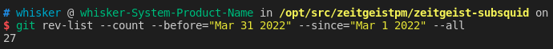
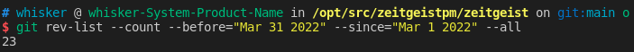
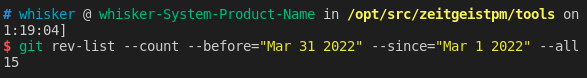
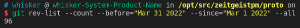

# Monthly Report #202203

本月我们迎来了主网上线的最后准备时间，目前项目已进入代码审计环节，一旦解决完所有的问题，我们将会进行主网上线，同时之后也会进行我们的 TTE 活动。

## Tech

### Subsquid 集成

本月继续将 Subsquid 集成到 Zeitgeist 生态中，将 Subsquid 作为 Zeitgeist 中重要的数据索引工具，总计提交了 27 份 commits。下面是关键更新详情：

- 升级到 Subsquid v5（[#77](https://github.com/zeitgeistpm/zeitgeist-subsquid/commit/4df7e70f5dbe753c78ce1115283030265560d7f2)），包括：
  - 升级索引器（indexer）
  - 升级索引器网关
  - 为所有的 spec 增加元数据
  - 升级脚本，相关配置文件以及 dockerfile
  - 迁移余额中列出的映射处理程序
- 适配新的 Zeitgeist type v2（[#82](https://github.com/zeitgeistpm/zeitgeist-subsquid/commit/61b08f95e4025afa1bb8eac3036b78efa4ec0b5b)）
- 支持标量市场，包括为标量市场结果创建资产，识别标量市场 `currencyId` 以及利用 `market.outcomeAssets` 创建资产（[#83](https://github.com/zeitgeistpm/zeitgeist-subsquid/commit/5f742eec82baef90b2b3b8dadffba71b5e9191fa)）
- 手动修复余额以记录通过事件/外部数据不可用的活动（[#89](https://github.com/zeitgeistpm/zeitgeist-subsquid/commit/a280a4f6ce5229bcab2ef2d833802e7378db34ba)）
- 创建平行链质押奖励事件以及 handler（[#90](https://github.com/zeitgeistpm/zeitgeist-subsquid/commit/31acdfd55ee302e29605d266a40166f98bb23c59)）
- 支持资产池账户，为账户增加 `poolId` 映射（[#94](https://github.com/zeitgeistpm/zeitgeist-subsquid/commit/fdc9f194da7d787198ae68518622c15b2dba66e7)）
- 在交易信息中增加账户信息（[#99](https://github.com/zeitgeistpm/zeitgeist-subsquid/commit/625f702015bc325f548326e307c639890c493078)）
- 支持每个账户中不同资产的价值计算（[#102](https://github.com/zeitgeistpm/zeitgeist-subsquid/commit/f7f6ec93b1ed766e1d01243287983e8b6bc8eb32)）
- 支持每个账户中不同资产的总价值计算（[#104](https://github.com/zeitgeistpm/zeitgeist-subsquid/commit/87f702b1c1e49975f8519b0580db6dd67d1ee6c2)）

### 协议

本月 Zeitgeist 协议的改动不多，主要针对 Polkadot 的升级进行同步升级适配，总计提交了 23 份 commits。下面是关键更新详情：

- 由于 Substrate 的更新，支持存储版本指定（[#472](https://github.com/zeitgeistpm/zeitgeist/commit/694a221ce892974d57beb1e28388bbfc6544adab)）
- 移除 `txfilter` 模块，使用抽象的 `BaseCallFilter` 进行过滤（[#441](https://github.com/zeitgeistpm/zeitgeist/commit/5f0b7f5023a7603896309b3f33b185ca5862d688)）
- 在 `Rikiddo` 模块中移除 panickers，将部分冗余代码进行抽象（[#470](https://github.com/zeitgeistpm/zeitgeist/commit/06994c58f2f03d1f453a547eb3ab932fc2346ff8)）
- 将代码库更新到 polkadot-0.9.16 并完成适配（[#458](https://github.com/zeitgeistpm/zeitgeist/commit/410ae41b363beea6c098f130a270e1569e0ef538)）
- 确保不会在链上遗留 orphaned pool（孤资产池）（[#432](https://github.com/zeitgeistpm/zeitgeist/commit/463dd1349b1f4148c682d95aa77c2b4b0f704ec3)）
- 阐明并实现 `bpow` 和 `bpow_approx` 的数值限制，并增加相关测试（[#474](https://github.com/zeitgeistpm/zeitgeist/commit/7de4d2c79eefbe7403206330f619d904e18784f0)）

  - 修改 `MaxInRatio` 和 `MaxOutRatio` 两个参数计算方式，以对大规模资产池操作（创建或移除）进行限制（[#475](https://github.com/zeitgeistpm/zeitgeist/commit/9ca3d7e71c42fc1904d7ecfc4aa88003e19a8a5c)）

- 修改买卖全资产的参数，增加 `amount` 参数（[#491](https://github.com/zeitgeistpm/zeitgeist/commit/3f6b91bbe83c915588dd52eb2adba67509547528)）
- 为 Moonbeam 的集成进行适配（[#488](https://github.com/zeitgeistpm/zeitgeist/commit/9b1e7091bf429d87a590a74de6f6941d5c50e70f)）
- 增加民主治理模块（[#494](https://github.com/zeitgeistpm/zeitgeist/commit/4813294540f934ed769594dfbf4ce510bbfe8298)）
  - 增加民主 pallet
  - 为总理事会和技术委员会添加集体和会员实例
  - 为每个集体创建多个来源，选票百分比
  - 修改相关配置

### SDK

本月 SDK 继续快速迭代，版本号从 v0.4.8-alpha.2 迭代到 v0.4.10 ，总计提交了 15 份 commits。下面是关键更新详情：

- 升级并适配 Subsquid v5 并发布 SDK v0.4.8-alpha.3 版本（[#171](https://github.com/zeitgeistpm/tools/commit/0f3639214cb81a0d68a02178144367f539b927fd)）
- 通过 Subsquid 获取资产历史价格并发布 SDK v0.4.8 正式版本（[#173](https://github.com/zeitgeistpm/tools/commit/495bfffe66fb259a56a74bc39fafdff586b704ae)）
- 增加 IPFS 地址配置项并发布 SDK v0.4.9 版本（[#175](https://github.com/zeitgeistpm/tools/commit/b4638ebb9b80c33b6e90a029ac423318a9d6dde3)）
- 修改部分函数以支持标量市场并发布 SDK v0.4.10 版本（[#176](https://github.com/zeitgeistpm/tools/commit/066b5eaba281c12ddce528440c3f2ee5010d77cb)）
- 增加通过 Subsquid 查询资产历史价格接口并发布 SDK v0.4.11 版本（[#177](https://github.com/zeitgeistpm/tools/commit/ef7d96aaca8ab90fd6d7cc65b267c733dcfcd43b)）

### APP 优化

本月大部分工作为 APP 的优化设计，目前 APP 还未开源，总计进行了 96 份 commits

### 其他开发

- 目前正在进行主网上线前最后的代码审计环节。

- 目前团队还在针对下一次大型市场营销活动进行相关网站以及工具的开发，包括 NFT 功能的进一步探索，尚未开源。
- 已在 Zeitgeist 余额查询界面更新众贷奖励数量，大家可以通过 `https://balance.zeitgeist.pm/` 网站进行查询。

## 市场

- 与 Karura 团队合作,将 aUSD 集成到 Zeitgeist 平台中,帮助用户避免受制于加密货币的价格波动。

- 与 Subscan 团队的数据分析套件完成集成，允许用户阅读我们的链上数据并获得我们位于 Kusama 平行链上的实时信息。

- 开始搭建 Dsicord 中文专属服务器，进一步专注于服务中文社区。

- 翻译并编辑预测市场有关的科普文章，为社区提供更详细的预测市场知识。

- 加入 Acala 2.5 亿生态基金计划，进一步支持 Polkadot/Kusama 生态中稳定币 aUSD 的生态扩展。

