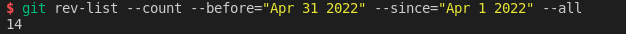
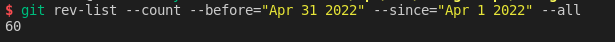
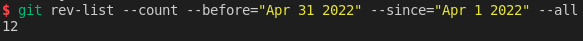
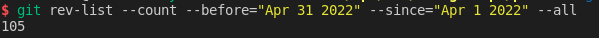

# Monthly Report #202205

本月我们迎来了主网上线的最后准备时间，目前代码审计即将完成，一旦解决完所有的问题，我们将会进行主网上线，同时之后也会进行我们的 TTE 活动。

## Tech

### Subsquid 集成

本月继续将 Subsquid 集成到 Zeitgeist 生态中，将 Subsquid 作为 Zeitgeist 中重要的数据索引工具，总计提交了 14 份 commits。下面是关键更新详情：

- **在主网上部署基于 Subsquid 的数据处理器：**
  - 在 Battery-Station 测试网上部署基于 Subsquid 的数据处理器，为主网部署进行真实环境测试（[#121](https://github.com/zeitgeistpm/zeitgeist-subsquid/commit/48859e89ff67c74c3bae3c5dea5aa5111fb6b50c)）
  - 将索引器部署到主网上，并添加相应脚本（[#123](https://github.com/zeitgeistpm/zeitgeist-subsquid/commit/be9fd754b9c27253150e671c64b3fd0d0a6a69bc)）
  - **将数据处理器部署到主网上，并添加相应脚本**（[#134](https://github.com/zeitgeistpm/zeitgeist-subsquid/commit/9b6fe2320b043b6c7712590ea0761eefd902cb48)）
- **在处理器中加入针对市场结算更新相关余额和结果 token 价格的事件与方法：**
  - 在处理器中加入更新失败账户结算处理过程并添加到历史数据中（[#125](https://github.com/zeitgeistpm/zeitgeist-subsquid/commit/b1590532a0d5851728b1780b142da885c9c7f9c4)）
  - 在处理器中加入更新结算市场后结果 token 价格方法并添加到历史数据中（[#126](https://github.com/zeitgeistpm/zeitgeist-subsquid/commit/a1fd4b7b6e79a6c7d8afebd44b5b31caebde9945)）
  - 在处理器中加入更新获胜账户结算处理过程并添加到历史数据中（[#127](https://github.com/zeitgeistpm/zeitgeist-subsquid/commit/06164947254fcae29f2b28f11e5351debddbdd75)）
  - 在处理器历史数据中加入因为结算而导致的资产数量变化（[#130](https://github.com/zeitgeistpm/zeitgeist-subsquid/commit/727cc1205ea308646d65216f8ee51c050f37d309)）
- 解决了配对结果交易导致的结果价格变化 bug（[#129](https://github.com/zeitgeistpm/zeitgeist-subsquid/commit/6f5ff50d71b9ba20e89cc9a8c93465d99a7f2c5e)）
- 在市场创建时增加对账户 id 的记录（[#133](https://github.com/zeitgeistpm/zeitgeist-subsquid/commit/eb81902ee71b5b9cfd5b08b6dd3c667612a56040)）
- 处理了由于调用方法位数限制导致的余额 bug（[#122](https://github.com/zeitgeistpm/zeitgeist-subsquid/commit/82e25c0d3985edd66210fe0988550118c6fcedc7)）
- 在处理器中加入市场赎回过程，并完成历史数据记录（[#124](https://github.com/zeitgeistpm/zeitgeist-subsquid/commit/8ff3a95192d534cafefefbaf7c9a7f071a9b4dd9)）

### 协议

本月 Zeitgeist 协议进行了大量改进，主要针对资产池进行了比较多的调整，总计提交了 60 份 commits。下面是关键更新详情：

- 借鉴 Polkadot 对于国库提案的处理，取消了普通用户能够取消 pending 状态的市场的能力（[#556](https://github.com/zeitgeistpm/zeitgeist/commit/dfcec232a973bfd99f8c936f160ee21a792fb9a7)）
- 升级 `spec_version` 和 `transaction_version` 并使用 `#[pallet::compact]` 对调用参数进行优化（[#578](https://github.com/zeitgeistpm/zeitgeist/commit/68a04957fa20761a0da95df0b4511c880bfc74b4)）
- 为适配 Subsquid 中对于账户的信息要求，为 `MarketCreated` 事件增加 `market_account` 字段， `PoolCreate` 事件增加 `pool_account` 字段。（[#594](https://github.com/zeitgeistpm/zeitgeist/commit/93ea1ce40b99ea373b6aad53099b587c82abbd58)）
- 解决 Advised 类型市场中有效性债券（ValidityBond）在结算时产生的 bug，只在 Permissionless 的市场中保留有效性债券（[#580](https://github.com/zeitgeistpm/zeitgeist/commit/ff563b8b5fc8922c2038339c64bfc9a7b9d8c755)）
- 在拒绝市场时不保留预言机债券（OracleBond）（[#604](https://github.com/zeitgeistpm/zeitgeist/commit/4d4268109203e8311893b7bb8793b4fdba330714)）
- 解决在销毁市场时产生的债券和资产 bug，同时增加销毁交易池（destroy_pool）方法并增加相关测试（[#586](https://github.com/zeitgeistpm/zeitgeist/commit/beaa06dafdc25f56245d9a1357e479f22afae9f0)）
- 解决市场未处于关闭状态下也可以进行报告（Report）的操作所引发的 bug，并完善了相关场景的测试（[#577](https://github.com/zeitgeistpm/zeitgeist/commit/d9e2878be9326669aed863f572073c422a0889fc)）
- 由于只有在市场处于 `Proposed` 状态下才能被拒绝，为此增加了市场状态的检查，并完善相关场景测试（[#585](https://github.com/zeitgeistpm/zeitgeist/commit/b6d39ca5eb2a48b91939ed2379c23e9698bb8579)）
- 增加了补贴最小金额设置，同时在 `pool_join_subsidy` 中增加金额检查，并完善相关场景测试（[#601](https://github.com/zeitgeistpm/zeitgeist/commit/d26258b7d0053567b483573dc402e6d389bb15ef)）
- 解决了在 `set_pool_to_stale` 中可能存在的恶意指定错误市场类型的 bug，并完善相关测试（[#582](https://github.com/zeitgeistpm/zeitgeist/commit/eb60a028f745e85bd82d8030396a3ab38f2ce776)）
- 将 `deploy_swap_pool_and_additional_liquidity` 函数增加到公共可调度列表中（[#619](https://github.com/zeitgeistpm/zeitgeist/commit/b224bdde223f263e139dca46092a950a7eb6438a)）
- 将相关外部调用设置为 `#[transactional]`，并发布 v0.3.2 版本（[#576](https://github.com/zeitgeistpm/zeitgeist/commit/0518c7e81dc662950e404c067445cbc1406c41a4)）
- 增加代理 pallet 以支持更复杂的密钥管理（[#613](https://github.com/zeitgeistpm/zeitgeist/commit/693c5c0039948787322b3f35e83dc8a298bb482b)）
- 增加 `MaxMarketPeriod` 常量，确保市场时间段的有效性，并完善相关场景测试（[#614](https://github.com/zeitgeistpm/zeitgeist/commit/314c2548f5b96738525beae43818632b50c60afe)）
- 重写 `authorized` pallet，允许 `DisputeApi` 在解决争议时的失败场景同时实现了争议失败的相关操作，并完善相关场景测试（[#574](https://github.com/zeitgeistpm/zeitgeist/commit/1447247ddcbc387bcf950c9b2d0ea7acdf39c452)）
- 对于运行时增加压力测试，同时更新权重值，将 `parachain-staking` 加入到需要压力测试的 pallet 列表中（[#627](https://github.com/zeitgeistpm/zeitgeist/commit/ce520be36cc06d6687ca2f5c8499d2deb762d32d)）
- 在 `create_scalar_markets` 中增加结果范围的检查，并完善相关测试（[#649](https://github.com/zeitgeistpm/zeitgeist/commit/ab2a8e629d736f5fdb744583b232300b0918adef)）

### SDK

本月 SDK 逐渐稳定，版本号从 v0.4.10 迭代到 v0.5.1 ，总计提交了 12 份 commits。下面是关键更新详情：

- 升级并适配 Zeitgeist v0.3.0 并发布 SDK v0.4.13 版本（[#180](https://github.com/zeitgeistpm/tools/commit/ff65bd7a54c027d3660c83e32ceac82a3b0d6642)）
- 升级并适配 Zeitgeist v0.3.1 并发布 SDK v0.4.14 版本（[#181](https://github.com/zeitgeistpm/tools/commit/5ad9f2a8dd680645a8afe33d3e80200ffedcef51)）
- 升级并适配 Polkadot/api-v8.1.1 并发布 SDK v0.5.0 版本（[#183](https://github.com/zeitgeistpm/tools/commit/443afb3513dfdd447b724c59588569c13dfc2be4)）

### APP 优化

本月大部分工作为 APP 的优化设计，目前 APP 还未开源，总计进行了 105 份 commits

### 其他开发

- 代码审计进入尾声，正在针对一些上线前需要修改的部分进行改动。

- 目前团队还在针对下一次大型市场营销活动进行相关网站以及工具的开发，包括 NFT 功能的进一步探索，尚未开源。

## 市场

- 举办 Twitter Space 与社区探讨预测市场

- 参与 CESS 举办的为 Zeitgeist,CESS 及 Bifrost 在 Polkadot Decoded 的投票活动

- 区块链工程师 Harald 在 Amsterdot 2022 黑客松上演讲

- 参与由 PolkaWorld 举办的关于 Web3 的推特 Space 讨论

- 经济研究员 Numa 前往多所教育机构及学校演讲

- 首席信息官 David 参与波卡投资方 Scytale Ventures 以及 BIL 举办的线下讨论会
