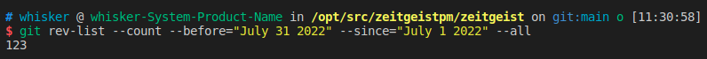
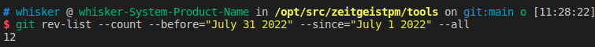

# Monthly Report #202206

本月我们最大的成果是取得了新的里程碑---启动 TGE 以及 TTE，为 Zeitgeist 开启了崭新的篇章。

## Tech

### 协议

本月 Zeitgeist 协议进行了大量改进，完成了 TTE 启动前的最终调整，以确保上线的安全性，总计提交了 112 份 commits。下面是关键更新详情：

- 借鉴 Parity 的做法，将行为准则模板添加到存储库中，以便指导贡献者对如何与项目进行交互（[#647](https://github.com/zeitgeistpm/zeitgeist/commit/d9418e734197161821c523f151dda55b051ee4dc)）
- 对于非活跃状态下的市场，调用 `admin_move_market_to_closed` 进行报错（[#637](https://github.com/zeitgeistpm/zeitgeist/commit/bc7631e24c098c3e621406dac8cf9f88f1aa9c3e)）
- 将 `MarketCommonsApi` 中的 `report` 函数删除（[#633](https://github.com/zeitgeistpm/zeitgeist/commit/e4ef326410e87052221c705cb6fbe139aa707b37)）
- 删除陈旧的 `Outcome` 存储（[#630](https://github.com/zeitgeistpm/zeitgeist/commit/edd8f48a5ec0b8e5dff2ea84a1db89edc650e8c3)）
- 将 `swap_exact_amount_in` 和 `swap_exact_amount_out` 中的 `amount` 和 `price` 上下限转为 `Option` 类型（[#590](https://github.com/zeitgeistpm/zeitgeist/commit/12c8efc6d2d787592449addcd8a1bad6a40ba63f)）
- 修复 `MarketCounter` 相关 bug 并增加相关测试（[#636](https://github.com/zeitgeistpm/zeitgeist/commit/7aa561389e4d1f6fe00ccf95a85d65293f668877)）
- 去除所有交易过滤器相关的外部 pallet（[#660](https://github.com/zeitgeistpm/zeitgeist/commit/9d40a09af597d1cbdc540df9922f4c2a40a78dcb)）
- 将 `amount_base_asset` 和 `amount_outcome_assets` 简化为 `amount` 参数（[#587](https://github.com/zeitgeistpm/zeitgeist/commit/3243f304df4937f43654927f82ea64623b485a8a)）
- **实现在创建资产池时不允许创建相同结果资产方案并发布 v0.3.3**（[#666](https://github.com/zeitgeistpm/zeitgeist/commit/49ab68a2c488bfad2a3beeae84264931965389c3)）
- 实现市场到期后市场和资产池自动转换到 `closed` 状态（[#651](https://github.com/zeitgeistpm/zeitgeist/commit/bef0b3461dfcce4f81fc361f729eefa340bf19d1)）
- 为防止偷跑作恶者的攻击，强制用户在调用 swap 时设置上下限（[#674](https://github.com/zeitgeistpm/zeitgeist/commit/340095e210269bab1536be6a0f8dd4f70c5b967d)）
- 修复市场结算后发起争议的 bug（[#669](https://github.com/zeitgeistpm/zeitgeist/commit/6c0b74dc7078b51fd1426023a5174fb8058ee132)）
- 修复重新同步区块后 `market_close_manager` 造成的时间戳 bug（[#684](https://github.com/zeitgeistpm/zeitgeist/commit/1990143de2b6caba1e85ed8898e5f5525b40510c)）
- 修改 `deploy_swap_pool_and_additional_liquidity` 和 `deploy_swap_pool_for_market` 的权重参数为向量（[#672](https://github.com/zeitgeistpm/zeitgeist/commit/c0f268c6f33cee4063e252e692a198894f9d2829)）

### SDK

所以本月 SDK 版本号从 v0.5.2 迭代到 v0.6.3 以适配 TTE，总计提交了 17 份 commits。下面是关键更新详情：

- 升级并适配 Polkadot Api v8.7.1 并发布 SDK v0.5.3 版本（[#188](https://github.com/zeitgeistpm/tools/commit/f2050c81bddca2911ab499e81bd2bcc3c75b8ed8)）
- 重构创建市场的接口，将创建市场行为抽象为统一接口（[#189](https://github.com/zeitgeistpm/tools/commit/55d197c68f9c17b5b3195abf54ece029a4ae1fb6)）
- 修改 `swaps.swapExactAmountIn` 和 `swaps.swapExactAmountOut` 参数，并为 cli 工具适配 sdk 的更新（[#191](https://github.com/zeitgeistpm/tools/commit/b3937615d496e8a146e6f1518e5d26c552d3f903)）
- 将 endpoint 加入参数配置，供开发者自行配置（[#192](https://github.com/zeitgeistpm/tools/commit/ab26de992d19cc9f0ee9c972f05e96a2d456a2d8)）
- 将 `createCpmmMarketAndDeployAssets` 和 `deploySwapPoolForMarket` 中的 `amounts` 和 `baseAmount` 参数进行合并，并发布 v0.6.1 版本（[#193](https://github.com/zeitgeistpm/tools/commit/3d9c3df25b15ed0d2884ecb703240be9cd857345)）
- 添加 `deploySwapPoolAndAdditionalLiquidity` 接口并发布 v0.6.1 版本（[#195](https://github.com/zeitgeistpm/tools/commit/12ca5fdd2f1ab6a50524f2e6ef5667b39a9049e9)）
- 在 SDK 中支持 ipfs 集群并移除 Auth 验证，发布 v0.6.3（[#187](https://github.com/zeitgeistpm/tools/commit/0728c56a3a398c368c794ee8a2d68e5bbd091820)）

## 市场

- 发布与预测市场的相关文章

- 发布关于预测市场及 Zeitgeist 基础设施的文章

- 技术总监 Jorn 举办线上 Workshop 指导开发人员如何使用 Zeitgeist SDK

- CEO Logan 接受 Polkaworld 采访

- 开启 TGE 并分发代币给用户

- 发布 TGE&TTE 相关讯息

- 经济研究员 Numa 发布 TGE 分析报告

- CEO Logan 及社区经理 James 参加 2022 Polkadot Decoded 大会并分表发表演讲
