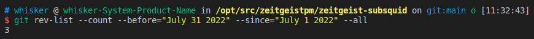

# Monthly Report #202207

在成功完成 TGE 以及 TTE 后，我们在 7 月将重点放在即将上线的 App 的优化以及策划新的一期大型营销活动。用户将很快可以体验我们全新的预测市场 app 并通过参与新的活动更加全面了解我们的产品以及 App 的使用。

## Tech

### 协议

本月 Zeitgeist 协议进行了大量改进，完成了 TTE 启动前的最终调整，以确保上线的安全性，总计提交了 112 份 commits。下面是关键更新详情：

- 更正 Membership 中关于 `Council` 和 `AdvisoryCommittee` 的引用错误（[#692](https://github.com/zeitgeistpm/zeitgeist/commit/396af2afc4fac9860da4d5caca221bd9f3931c70)）
- 增加了 `Contributing` 文档，为社区贡献进行一定规范，大家可以在贡献前先阅读该[文档](https://github.com/zeitgeistpm/zeitgeist/blob/main/CONTRIBUTING.md)（[#648](https://github.com/zeitgeistpm/zeitgeist/commit/a3495993824978eaca50deaa1feab7caec466c47)）
- 优化 `swap` 模块中的模糊测试，并添加创建资产池的功能（[#542](https://github.com/zeitgeistpm/zeitgeist/commit/464180f103acb7898e82d45ba7f39087ec595c07)）
- 修复 `Dispute` 在完成后未及时在存储中清楚相关数据的 bug（[#681](https://github.com/zeitgeistpm/zeitgeist/commit/815d92af2c8d542147cb8bbe58433e820b2be85d)）
- 为移除 `sudo` 权限增加 `without-sudo` 功能并发布 v0.3.4 版本（[#702](https://github.com/zeitgeistpm/zeitgeist/commit/723171517d5c7ea94b9bb22ea9289c2dd8d7fc5f)）
- 将 `pallet_author_slot_filter` 暴露出来，以便可以通过链上治理来修改其中的 `eligibleCount` 值（[#706](https://github.com/zeitgeistpm/zeitgeist/commit/899ed47700030ce67ba404d83ea22fb981e67b0b)）
- 更新 Pallet 中的权重值（[#705](https://github.com/zeitgeistpm/zeitgeist/commit/893344f10798a51294f1bfcb6d4db251000df750)）
- 修复 `MarketType` 和 `MarketPeriod` 中 `max_encoded_len` 函数的相关 bug（[#703](https://github.com/zeitgeistpm/zeitgeist/commit/a98281e5149ef0880477f30dafd5a2b3ca54b8cc)）
- **实现市场交易池中的 `swap_fee` 功能**（[#676](https://github.com/zeitgeistpm/zeitgeist/commit/852ebea1ac6a3d5d3ec6212e01fa2b588a27a65c)）
- 对 `base_asset` 进行抽象，以方便之后支持多元 token 的交易（例如 aUSD）（[#629](https://github.com/zeitgeistpm/zeitgeist/commit/61e1bebe1415929bbdd0bfabb17ba7581e2bdf04)）
- 修复 `Dispute` 过程中可能引发的除零 bug（[#701](https://github.com/zeitgeistpm/zeitgeist/commit/87264f8130b746880dfdbc6f30bad97e662c4f95)）
- 在 `Court` 中将 `Jurors` 的类型进行更改，以优化其性能（[#707](https://github.com/zeitgeistpm/zeitgeist/commit/789d565bde29cb58836dda658def7490b1163924)）
- 增加市场状态 `Initialized`，该状态下将限制交易（[#695](https://github.com/zeitgeistpm/zeitgeist/commit/ba6efa8a2d20884bd2abb3077a341d633ee14f0d)）

### Subsquid 集成

本月继续将 Subsquid 集成到 Zeitgeist 生态中，将 Subsquid 作为 Zeitgeist 中重要的数据索引工具，总计提交了 18 份 commits。下面是关键更新详情：

- 适配并升级 Zeitgeist v0.3.4（[#138](https://github.com/zeitgeistpm/zeitgeist-subsquid/commit/267514a2ea603f72acf7e0c5f85fc81ffdc61da6)）
- 增加预测市场关闭事件（[#139](https://github.com/zeitgeistpm/zeitgeist-subsquid/commit/5c783c03596f3e893152a3be4fcb6c3a4edd8e79)）
- 删除预测市场取消事件（[#140](https://github.com/zeitgeistpm/zeitgeist-subsquid/commit/24c5d238abbc76bdb2b84de9e9ea96bb77197773)）
- 增加市场到期事件和资产池关闭事件（[#141](https://github.com/zeitgeistpm/zeitgeist-subsquid/commit/831c4a59d51a06186a3f46b425443f1ad4dcd430)）

### SDK

所以本月 SDK 版本号从 v0.5.2 迭代到 v0.6.3 以适配 TTE，总计提交了 17 份 commits。下面是关键更新详情：

- 升级并适配 Zeitgeist v0.3.4 并发布 SDK v0.6.4 版本（[#203](https://github.com/zeitgeistpm/tools/commit/8488e9aaee0782c88143e6bb6b18298297a0c6c6)）

### 其他开发

- APP 即将发布

- API 完成大部分开发任务，即将公开

- Zeitgeist 新版文档网站已发布

## 市场

- 发布与预测市场相关的科普教程

- 发布如何质押 ZTG 的相关教程

- 技术总监 Jorn 举办线上 Workshop 指导开发人员如何使用 Zeitgeist SDK

- 社区经理 BOb 参加线下 Dotsama 研讨会
