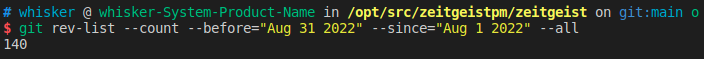
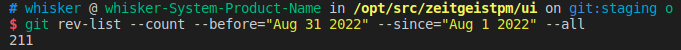
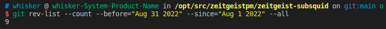

# Monthly Report #202208

8月是令人无比兴奋的一个月！Zeitgeist通过与ChianTroopers的合作，完成了最终的代码审计并修复了所发现的所有问题，这预示着又一个新的重要里程碑的实现！在完成最后的打磨后，我们的app即将发布！

## Tech

### 协议

本月 Zeitgeist 协议跟据审计报告进行了最终的代码修复，总计提交了 140 份 commits。下面是关键更新详情：

- 优化市场和资产池之间的开启逻辑（[#711](https://github.com/zeitgeistpm/zeitgeist/commit/dffd0e9fca361440a9341e34d3239ee80c5833b1)）
- 引入 `styx` pallet，以支持用户 claim 他们的 app 头像（avatar）时销毁一定的 ztg（[#725](https://github.com/zeitgeistpm/zeitgeist/commit/1307e2a78b96d2603aca3497334132b62ebcc2de)）
- 在 CPMM 逻辑中增加流动性池的最小允许余额并完善相关测试（[#733](https://github.com/zeitgeistpm/zeitgeist/commit/b79f2ed4fec5acdd245e3358be0de90ea4bbf364)）
- 在 `resolution_manager` 中删除 `MarketIdsPerReportBlock` 和 `MarketIdsPerDisputeBlock`，实现迁移以清除存储中的旧值。（[#729](https://github.com/zeitgeistpm/zeitgeist/commit/3c7e8301e03eccecde82668f53cc05dbd3054311)）
- 修改项目架构，以支持处理多个运行时（[#721](https://github.com/zeitgeistpm/zeitgeist/commit/a6ec39273e5a20ecb38d79dea5b0374abe935b41)）
- 允许单个 `AdvisoryCommittee` 成员批准市场运行，同时所有 origin 不必为他们的服务支付任何费用（[#744](https://github.com/zeitgeistpm/zeitgeist/commit/c37d2d552fa9dd47c6be85ed908c6d4381472b0c)）
- 对 Zeitgeist 运行时更新配置（[#749](https://github.com/zeitgeistpm/zeitgeist/commit/8788f42732e2e7dd0053390074d005b332d0d6c0)）

---

### APP

本月APP为优化重点，总计提交了211份 commits。下面是更新重点：

---

### Subsquid 集成

本月继续将 Subsquid 集成到 Zeitgeist 生态中，将 Subsquid 作为 Zeitgeist 中重要的数据索引工具，总计提交了 9份 commits。下面是关键更新详情：

- 增加市场到期事件以及资产池关闭事件处理（[#141](https://github.com/zeitgeistpm/zeitgeist-subsquid/commit/831c4a59d51a06186a3f46b425443f1ad4dcd430)）
- 增加 `disputeMechanism` 字段，保证争议细节可以从链上获取（[#144](https://github.com/zeitgeistpm/zeitgeist-subsquid/commit/b9140c11944e3aedb7922c0da4fe75dd13060a87)）
- 为 Subsquid 处理器和查询节点构建 Docker 镜像（[#146](https://github.com/zeitgeistpm/zeitgeist-subsquid/commit/8b8d8891e19807459a315da43de0dae604ab36be)）
- 通过 Polkadot.js 验证账户余额，用链上数据保证 Subsquid 的数据正确性（[#148](https://github.com/zeitgeistpm/zeitgeist-subsquid/commit/cfa404ddb9e1bf227dcdf9475ea30a3625497a9c)）
- 通过 Polkadot.js 验证账户余额历史（[#150](https://github.com/zeitgeistpm/zeitgeist-subsquid/commit/56dfbd6fc70fe2091be470fb77061946cedbdd7e)）
- 增加查询节点脚本，方便对其进行管理（[#152](https://github.com/zeitgeistpm/zeitgeist-subsquid/commit/117d32b960127f5fc9a4ce742c039d41ed52e188)）
- 在现货价格计算中移除 `swapFee`（[#154](https://github.com/zeitgeistpm/zeitgeist-subsquid/commit/55a4a927dfbfe51c4d29175819348af79786978c)）

---

### SDK

本月 SDK 版本迭代到 v0.8.2，总计提交了 32 份 commits。下面是关键更新详情：

- 升级并适配 Zeitgeist v0.3.4 并发布 SDK v0.6.5 版本（[#205](https://github.com/zeitgeistpm/tools/commit/cd3417b60ab5095a93089d3e1cd0869c0b9473cf)）
- 将所有的 `Ended` 状态修改为 `Closed` 状态 并发布 SDK v0.6.6 版本（[#204](https://github.com/zeitgeistpm/tools/commit/9a7e9f62c211368a0f32151987e3f0d4459b0699)）
- 从新字段 `disputeMechanism` 中获取争议信息细节 并发布 SDK v0.7.0 版本（[#206](https://github.com/zeitgeistpm/tools/commit/03d5066e5089f899d0513b8467539998dd2c6439)）
- 使用 ipfs 集群存储部分信息并发布 SDK v0.7.1 版本（[#207](https://github.com/zeitgeistpm/tools/commit/699b2247fe6988ecfdd26c6c5a08969d2ad3bb50)）
- 上传信息到 ipfs 集群前对 ipfs 集群 url 进行检查（[#208](https://github.com/zeitgeistpm/tools/commit/2bf8be22a7559c0c9f51276a426884c35680cd42)）
- 修复查询无流动性市场时可能出现的 bug 并发布 SDK v0.7，2 版本（[#211](https://github.com/zeitgeistpm/tools/commit/2807efc773b98785f3b6fdb46d8e23d92953a87f)）
- 优化 SDK 的连接性能并发布 SDK v0.7.3 版本（[#212](https://github.com/zeitgeistpm/tools/commit/e840ce1dad4bafd71d0fce2d6835c95fca736bde)）
- 实现如果上传信息到 ipfs 集群时发生错误时创建市场也会失败并发布 SDK v0.7.4 版本（[#214](https://github.com/zeitgeistpm/tools/commit/768f448c2c501eb378d4212887f8c343d6d63389)）
- 升级并适配 polkadot/api-v9.2.2 并发布 SDK v0.8.0 版本（[#209](https://github.com/zeitgeistpm/tools/commit/a531d0c1a8d6a88cdac45b09741e68d7e646686b)）
- 增加订阅市场变化接口并发布 SDK v0.8.1 版本（[#215](https://github.com/zeitgeistpm/tools/commit/679c6c734183f23856923e24ebbae962d64d4aaa)）
- 增加判断市场是否是标量类型的字段并发布 SDK v0.8.2 版本（[#217](https://github.com/zeitgeistpm/tools/commit/171c64e60559f8d2bf40fb5d80f8f5066cb44911)）

---

### 其他开发

- API 目前已公开，大家可以通过 `https://api.zeitgeist.pm/` 进行试用

- APP 以及协议的压力测试

- 公开基于 subsquare 的治理 APP，大家可以通过 `https://zeitgeist.subsquare.io/` 进行试用

- APP 集成的 NFT 服务继续开发，从 v0.2.1-alpha.0 迭代到 v0.3.2-alpha.0，目前还未开源

---

## 市场

- 与ChainTroopers合作完成了最终的代码审计，并发布审计报告

- 宣布“ParaDao”获得Zeitgeist在2022Polkadot全球黑客松北美站所提供的5000美元赏金

- 发布Zeitgeist最终审计报告

- 经济研究员numa在推特space举办西班牙社区大使讨论会

- OpenSquare 为社区成员提供了一个治理提议的交流平台

- 与元宇宙服装设计团队Digfun合作完成Decentraland可穿戴服装的设计
