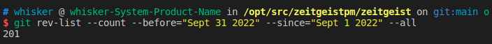
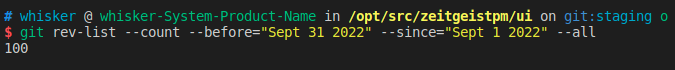
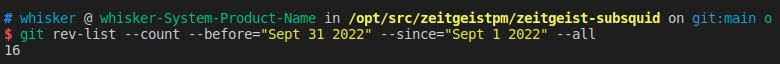
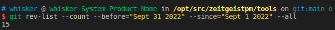

# Monthly Report #202209

9月，Zeitgeist取得了自成立以来最大的里程碑-Zeitgeist App正式发布！这标志着用户将能够以一种完全崭新的形式体验预测市场所带来的魅力！Zeitgeist将预测市场带入了一个新的时代！如果你还没有进行使用，欢迎前往app.zeitgeist.pm进行体验！同时，我们准备视频教程就如何使用Zeitgeist App进行了详细说明，详情请参考文末视频链接。

## Tech

### 协议

本月随着App的正式发布，Zeitgeist对代码进行了持续优化，总计提交了 201 份 commits。下面是关键更新详情：

- 补充了部分 pallet 的文档内容并更新了 runtime API 和 RPC 模块（[#764](https://github.com/zeitgeistpm/zeitgeist/commit/33d5f70daba111d546b223497f9351cf3f7c2c9c)）
- **将预测市场的最大支持分类数扩大到 64**（[#796](https://github.com/zeitgeistpm/zeitgeist/commit/294c66c4d070171fbe4389fbb63b1608e7df3ba8)）
- 通过引入一个叫做 `AdvisoryBondSlashPercentage` 的链上变量将 `AdvisoryBond` 在拒绝市场时的惩罚比例修改到 10%（[#802](https://github.com/zeitgeistpm/zeitgeist/commit/0616374b7d4e96960ffd91d24c38abf966e29cce)）
- 修改市场逻辑，目前当市场摧毁或者结算完成后仍然保留结果 token，不再进行资产清理（[#806](https://github.com/zeitgeistpm/zeitgeist/commit/b09f44bed399f8b37153e92a77a549f5a86deed8)）
- 修改项目架构，以支持处理多个运行时（[#721](https://github.com/zeitgeistpm/zeitgeist/commit/a6ec39273e5a20ecb38d79dea5b0374abe935b41)）
- 允许单个 `AdvisoryCommittee` 成员批准市场运行，同时所有 origin 不必为他们的服务支付任何费用（[#744](https://github.com/zeitgeistpm/zeitgeist/commit/c37d2d552fa9dd47c6be85ed908c6d4381472b0c)）
- 对 Zeitgeist 运行时更新配置（[#749](https://github.com/zeitgeistpm/zeitgeist/commit/8788f42732e2e7dd0053390074d005b332d0d6c0)）

---

### APP

本月 APP 为优化重点，总计提交了100份 commits。下面是更新重点：

- 修复市场过滤的功能（[#195](https://github.com/zeitgeistpm/ui/commit/c96d10f322a001c07571b97c3edaa823532ce68b)）
- 当预言机无法报告时支持所有人的报告（[#225](https://github.com/zeitgeistpm/ui/commit/847967bd38197ae8386c71f1a8dcb7c048755b1f)）
- APP 账户余额将不显示被锁定的 token 数量（[#261](https://github.com/zeitgeistpm/ui/commit/1a614667be28f97d9da601bc691ea5dbf4444626)）
- NFT profile 界面支持查看已赚取的 badge 列表（[#270](https://github.com/zeitgeistpm/ui/commit/08878b7762b1d4884762e3cdddf521fca1619cd5)）
- 优化报告显示的细节（[#237](https://github.com/zeitgeistpm/ui/commit/a23752c5abcc2758f3779e65ad86936db982463b)）

---

### Subsquid 集成

本月继续将 Subsquid 集成到 Zeitgeist 生态中，将 Subsquid 作为 Zeitgeist 中重要的数据索引工具，总计提交了 16 份 commits。下面是关键更新详情：

- 增加指定区块间用户余额变化查询（[#157](https://github.com/zeitgeistpm/zeitgeist-subsquid/commit/3626585817deba1d9b562253c4343eca358550ed)）
- 在标量市场中引入 `scalarType` 这个变量（[#158](https://github.com/zeitgeistpm/zeitgeist-subsquid/commit/e95257849d0f49b4e3c60484ab81d095fa43ce97)）
- 将 IPFS 的 cid 在市场元数据中暴露出来（[#168](https://github.com/zeitgeistpm/zeitgeist-subsquid/commit/708ff23abc87b3a30ae7da5331563f9a51f43326)）
- 修复之前 subsquid 中出现的导致现货价格出错的 bug（[#173](https://github.com/zeitgeistpm/zeitgeist-subsquid/commit/1fb2114bcab8e1cb6ea888415376251a3dd6084f)）
- 将 hydra-indexer-v5 升级到 Firequid 版本（[#166](https://github.com/zeitgeistpm/zeitgeist-subsquid/commit/5688a631cb16ab60d90919a4bc857ce44ff89147)）
- 针对之前的升级进行项目依赖等的适配（[#172](https://github.com/zeitgeistpm/zeitgeist-subsquid/commit/519e1d952e175509d42b3589a3639dc04f18dab2)）
- 修改现货计算逻辑，目前通过 `assetIn/assetOut` 来进行计算（[#181](https://github.com/zeitgeistpm/zeitgeist-subsquid/commit/713330013ef46e9c1d41b5b30af6fcffb12bd0da)）
- 增加了 `Swaps.PoolActive` 事件（[#183](https://github.com/zeitgeistpm/zeitgeist-subsquid/commit/7f0311894c5edd5690ec578dd04a6522d1f1b25e)）

---

### SDK

本月 SDK 版本迭代到 v0.8.6，总计提交了 15 份 commits。下面是关键更新详情：

- 优化 sdk 中对于市场过滤的逻辑并发布 v0.8.4 版本（[#219](https://github.com/zeitgeistpm/tools/commit/ac89ac7d23912e24aafdc0dde5a742b254c0fabc)）
- 通过市场元数据查询 IPFS 的 cid 并发布 SDK v0.8.5 版本（[#220](https://github.com/zeitgeistpm/tools/commit/2ca99a9408c156bd3e5d1a82a9402c9bc5667e91)）
- 支持从 dummy hash 中解码出 cid 和预计手续费并发布 SDK v0.8.6 版本（[#222](https://github.com/zeitgeistpm/tools/commit/62ddf1624a9f9050a5d23f15bd27369fb0f454f8)）
- 为 sdk 增加 demo 脚本，以便开发者学习使用（[#223](https://github.com/zeitgeistpm/tools/commit/b67d0aa2bdc85f8b4d9a38347b638970eaef11f4)）

---

### 其他开发

- 新版 SDK 正在开发中

---

## 市场

- Zeitgeist App 正式发布

- 启动NFT Launch Campagin活动

- 在Crowdcast举办Pre-Launch NFT Showcase活动

- 社区经理Bob参加Pendulum的社区会议

- 发布相关视频及文章教程指导用户如何从0开始使用Zeitgeist App

- 视频教程链接：
  1.如何创建波卡钱包 https://twitter.com/ZeitgeistChina/status/1575280743902846981?s=20&t=GotXupJSMcB32tZ1WiCvOg
  2.如何铸造头像NFT https://twitter.com/ZeitgeistChina/status/1575280975629942785?s=20&t=GotXupJSMcB32tZ1WiCvOg
  3.如何使用Zeitgeist App：https://twitter.com/ZeitgeistChina/status/1575281258334420992?s=20&t=GotXupJSMcB32tZ1WiCvOg

