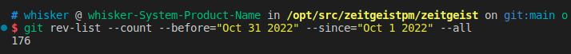
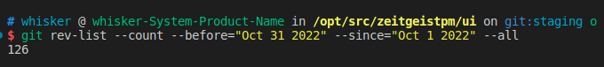
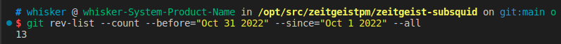
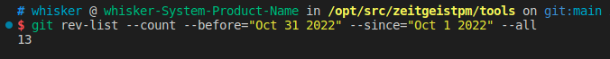

# Monthly Report #202210

10月，Zeitgeist团队不仅继续将产品更新改进作为首要任务，同时我们也增大了宣传力度.我们在Decentraland中举办的“Zeitgeist Launch Party” 活动，三天内吸引了近1000名用户访问！未来我们还将举办和参与更多社区活动以让其他社区了解和使用我们的项目。

## Tech

### 协议

本月Zeitgeist对代码进行了持续优化，总计提交了 176 份 commits。下面是关键更新详情：

- 增加创建市场时 `oracle_delay`，`oracle_duration` 和 `dispute_duration` 字段，同时修改相关字段名称（[#732](https://github.com/zeitgeistpm/zeitgeist/commit/b34eb1e9620fa6181a109cff879edb37686b525f)）
- 在配置常数中新增 `MIN_ORACLE_DURATION` 字段（[#821](https://github.com/zeitgeistpm/zeitgeist/commit/cadca835826737725f24b798612a27a9f2b095b9)）
- 修改交易费不再 burn，而是返还到国库，预测市场的罚款也将移入国库（[#814](https://github.com/zeitgeistpm/zeitgeist/commit/d058a9e3a740f83c2f26158f2908ba23f1932e5e)）
- 在 runtime 中加入赏金 pallet（[#776](https://github.com/zeitgeistpm/zeitgeist/commit/b1c51435325365d09f5e48e897a67950ab696009)）
- 修改相关系统常数，将 `MIN_DISPUTE_DURATION` 修改为 12 小时，`MAX_DISPUTE_DURATION` 修改为 1 个月，`MAX_GRACE_PERIOD` 修改为 1 年， `MAX_ORACLE_DURATION` 修改为 14 天（[#828](https://github.com/zeitgeistpm/zeitgeist/commit/cbf8baa7c4f36ce393f814504f510b41bd8cb2df)）
- 将 Advised 市场的罚款比例降为 0 并升级到 v0.3.6 版本（[#826](https://github.com/zeitgeistpm/zeitgeist/commit/5878a131ce7b7034892e76e115d92f67d3e93512)）
- 优化 `destroy_market` 和 `resolve_market` 中的操作过程（[#812](https://github.com/zeitgeistpm/zeitgeist/commit/ef2d62f180d45a229422e5ce6b7350a520c78c31)）
- 升级并适配 polkadot v0.9.23（[#811](https://github.com/zeitgeistpm/zeitgeist/commit/50339918748e597c6e13018dc97c4ccd4d001ef2)）
- 在 `MarketRejected` 事件中增加 `reject_reason`（[#835](https://github.com/zeitgeistpm/zeitgeist/commit/5994559f63b1f1b518e22f2987a2eaf8f8d95e20)）
- 支持将整数标量市场转换为支持 10 位小数的标量市场（[#838](https://github.com/zeitgeistpm/zeitgeist/commit/f0e46be1bfc4034dce18dfd0239bbe6ca656f52b)）
- 增加 `request_edit` 的外部调用（extrinsic），使用户可以对 `Proposed` 状态下的市场进行编辑（[#834](https://github.com/zeitgeistpm/zeitgeist/commit/01f4fbfaeb6421b0313ce55df8762187cf2f6cd3)）

---

### APP

本月APP优化总计提交了126份commits。下面是更新重点：

- 在流动性池页面将流动性池的价值以 usd 形式显示
- 支持 24 小时价格变化的升降序显示
- 为流动性提供者加入时提供 `exit_fee` 和滑点的介绍
- 修复无法 withdraw 流动性的 bug
- 修复出是页面流动性未显示的 bug
- 在加载市场卡片时无需等待 sdk 的初始化，加快加载速度
- 设置 oracle 时默认填入账户地址

---

### Subsquid 集成

本月继续将 Subsquid 集成到 Zeitgeist 生态中，将 Subsquid 作为 Zeitgeist 中重要的数据索引工具，总计提交了 13 份 commits。下面是关键更新详情：

- 支持所有资产类型的全集买卖（[#187](https://github.com/zeitgeistpm/zeitgeist-subsquid/commit/9605e91df9f395768ec902d6ab270da954a2ae74)）
- 设置价格的动态变化，并同步到账户余额中（[#189](https://github.com/zeitgeistpm/zeitgeist-subsquid/commit/cacb02e0e4ce5947a4a03edf83c94af2f3080626)）
- 移除 `whetherBuyOrSell` 函数，同时在批量调用时对 `maxPrice` 进行检查（[#195](https://github.com/zeitgeistpm/zeitgeist-subsquid/commit/e7333d1f8df500295949bd57ffbee04bbeb6fb45)）
- 支持 graphql 的订阅（[#202](https://github.com/zeitgeistpm/zeitgeist-subsquid/commit/4c87c65b397149367f4f835cc377dda06a1ae823)）
- 支持市场销毁事件（[#204](https://github.com/zeitgeistpm/zeitgeist-subsquid/commit/fcf1f26f9020546626ee785e156280cf99433c76)）
- 支持 token transfer 事件（[#207](https://github.com/zeitgeistpm/zeitgeist-subsquid/commit/e5b5d1609a9d6bcd69fe0ee49e3094c11ba44475)）
- 支持市场到期设置（[#209](https://github.com/zeitgeistpm/zeitgeist-subsquid/commit/4a97c85a4051b729ffc873fa508ef586a82d33c2)）
- 在市场中支持 `start` 和 `end` 字段（[#211](https://github.com/zeitgeistpm/zeitgeist-subsquid/commit/68e1fc1a71c3874ed5facd8ad5bbd5ce67f76d09)）

---

### SDK

本月 SDK 版本迭代到 v0.9.3，总计提交了 13 份 commits。下面是关键更新详情：

- 更新流动性计算并发布 v0.8.7 版本（[#226](https://github.com/zeitgeistpm/tools/commit/4fc90ba0496fa04178176cbba9532d36153cc602)）
- 更新并适配 zeitgeist v0.3.6 并发布 SDK v0.9.0 版本（[#229](https://github.com/zeitgeistpm/tools/commit/c826aec2ab1faf838bc9c951c09515bce1479d12)）
- 更新并适配 polkadot/api v9.5.1 并发布 SDK v0.9.1 版本（[#230](https://github.com/zeitgeistpm/tools/commit/4121c165de2ef626c5a3a0690ff91edf0fa8b65d)）
- 更新 `period` 字段（[#231](https://github.com/zeitgeistpm/tools/commit/2cba1195a0b6383ffeadfa736de95b2e862c8a16)）

---

### 其他开发

- 在文档中新增市场创建准则以及规范贡献规则

---

## 市场

- 发布第一个Zeitgeist改善提案

- Nova Wallet新增Zeitgeist Dapp

- 发布万圣节表情包创作大赛活动

- 商业增长顾问Devlin在polkadotsummit活动中演讲

- 在Decentraland中举办"Zeitgeist App Launch Party"

- 社区增长经理Bob受邀参加GameDao举办的twitter space

- CEO Logan 在polkadotsummit活动中演讲
