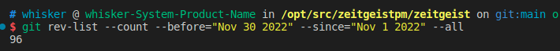
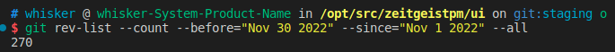
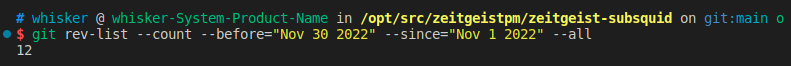
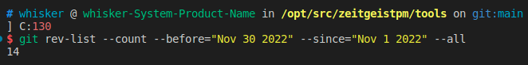

# Monthly Report #202211

11月，全球足球盛事世界杯如约而至，社区成员们也在我们的App上创建了许多与世界杯有关的预测市场来与所有人一起参与世界杯的预测！与此同时，Sub0大会的举办，也为我们与其他项目团队间提供了交流与学习的机会，让我们共同为波卡生态的发展而做出贡献！

## Tech

### 协议

本月Zeitgeist对代码进行了持续优化，总计提交了 96 份 commits。下面是关键更新详情：

- 新增一些存在一定风险的系统调用（[#846](https://github.com/zeitgeistpm/zeitgeist/commit/8930d07900df3fb7b28a0de3975a0397cd300e42)）
- 支持用户通过 `AuthorizedDisputeResolutionOrigin` 这个 pallet 来结算市场（[#778](https://github.com/zeitgeistpm/zeitgeist/commit/afa3567da7f0bfadaee43276cb2412cc5456a049)）
- 实现对于做恶的 oracle 的惩罚机制（[#814](https://github.com/zeitgeistpm/zeitgeist/commit/14e5d68c1a531cf9d5cb8e8a24a8679ccf53c8a6)）
- **实现了全局的争议系统（[#682](https://github.com/zeitgeistpm/zeitgeist/commit/31a123a84eb0aaf216da9484d5c529517cda6004)）**
- 根据 ZIP-01 实现了一种链上自动化套利机器人（[#833](https://github.com/zeitgeistpm/zeitgeist/commit/6fcdae899ed74fe71ede533ce9741750bee63935)）
- 在测试网中的 `Swap` 的 `getSpotPrices` 中新增 `fees_boolean` 字段（[#878](https://github.com/zeitgeistpm/zeitgeist/commit/7bddaf3a8c78b86cbb84f41a0775d87b4c986a2b)）
- 适配并升级 Polkadot 包到 v0.9.26（[#812](https://github.com/zeitgeistpm/zeitgeist/commit/8de3b3a2a02e7f4a6e373a9ef8bd442b9099c396)）
- 配置和测试白名单 XCM 的传输（[#661](https://github.com/zeitgeistpm/zeitgeist/commit/380f577d785e1cf4f5ced9d59aa3e4f8325acdaf)）
- 降低委员会争议的投票比率（[#890](https://github.com/zeitgeistpm/zeitgeist/commit/a9cacb3195bc159c0a2f40f56b767ea9e3753c7e)）

---

### APP

本月APP优化总计提交了270份commits。下面是更新重点：

- 新增市场页面并通过 Subsquid 来提高加载速度
- 在流动性页面中新增关于流动性的教程以方便用户学习并使用
- **新增以日期为结果的标量市场**
- 实现了分页和循环滚动的效果
- 使用新版 SDK 对资产池的加载进行重构，优化响应速度
- 新增精选市场
- 在精选和热门市场中增加价格显示

---

### Subsquid 集成

本月继续将 Subsquid 集成到 Zeitgeist 生态中，将 Subsquid 作为 Zeitgeist 中重要的数据索引工具，总计提交了 12 份 commits。下面是关键更新详情：

- 新增 `marketDestroyed` 函数，并支持将其同步到测试网中并能被测试网识别（[#217](https://github.com/zeitgeistpm/zeitgeist-subsquid/commit/63e6a436c0f706d2bf601781ee0d74864a91ccc7)）
- 通过账户有效性检查修复部分测试网余额问题（[#218](https://github.com/zeitgeistpm/zeitgeist-subsquid/commit/685af63826badb3e6f16df9a541b30e61cf923c1)）
- 在测试网中新建并支持处理 `BalancesDepositEvent` 事件（[#219](https://github.com/zeitgeistpm/zeitgeist-subsquid/commit/ac2e76279ad796de37bf7ae0117fa7fae18896a2)）
- 在测试网中新建并支持处理 `BalancesSlashedEvent` 事件（[#221](https://github.com/zeitgeistpm/zeitgeist-subsquid/commit/82e0a4ab61b77d13a689f77b35ae424efc77856a)）
- 整合区块链中区块中的奖励所引发的余额变化事件的处理（[#223](https://github.com/zeitgeistpm/zeitgeist-subsquid/commit/984dbea5013917ab8c111fca9d739450c1abf5e6)）
- 修改 `pool` 中的字段并完成适配（[#232](https://github.com/zeitgeistpm/zeitgeist-subsquid/commit/8f1c96e7fa36d4a62e7db6bf1584f421aaf6eaff)）
- 在测试网中新建并支持处理 `StyxAccountCrossedEvent` 事件（[#234](https://github.com/zeitgeistpm/zeitgeist-subsquid/commit/d74d9d34bb9086794777fd0e215741421711900c)）
- 新增 `dVolume` 字段，优化历史资产池查询（[#236](https://github.com/zeitgeistpm/zeitgeist-subsquid/commit/662d2f0b5e836c32d4bf1fdb83ac0cc4844e0b1e)）

---

### SDK

本月 SDK 版本迭代到 v0.10.2，总计提交了 14份 commits。下面是关键更新详情：

- 更新并适配 polkadot/api v9.6.2 并发布 SDK v0.9.3 版本（[#233](https://github.com/zeitgeistpm/tools/commit/f7fcaf7b17cc5e6422123a9ad4dd87441ccb0b3e)）
- 支持市场通过交易量 Volume 进行排序（[#236](https://github.com/zeitgeistpm/tools/commit/b7a6ff32742bce5dfe0eb9343bb4791e70cd65c5)）
- 在拒绝市场中新增 `Reason` 字段（[#237](https://github.com/zeitgeistpm/tools/commit/a222e58a17e28cb0922830d3fd5d1a78c7e5ec5a)）
- 修复获取活跃资产的接口并发布 SDK v0.10.1 版本（[#238](https://github.com/zeitgeistpm/tools/commit/ee3768727ac00a30fbd4ca078ea890a4a3a156eb)）
- 修复查询不存在资产池时产生的 BUG并发布 SDK v0.10.2 版本（[#240](https://github.com/zeitgeistpm/tools/commit/98be2be9f046021bd877c19cadf80e1ce6e745dc)）

---

### 其他开发

- 更新 Zeitgeist 中 Badge 库 Avatara 中的依赖包
- 对 Zeitgeist 中 LMSR 的实现进行优化 
- 对于 Rikiddo 增加了 Rust 版本的实现，为之后引入 Zeitgeist 做准备

---

## 市场

- 发布第一版Zeitgeist简报

- Zeitgeist成功拍下一条新的Kusama插槽

- 区块链技术开发 Harald Heckmann 在Sub0大会上演讲

- 产品开发人员Devlin 在PolkadotSummit大会上演讲
