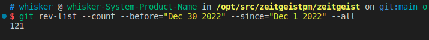
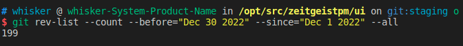
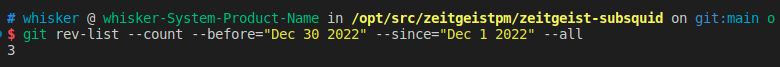

# Monthly Report #202212

随着世界杯的落幕，让我们恭喜阿根廷以及在我们的预测市场App中成功预测阿根廷获胜的用户们！在冠军揭晓前，阿根廷队便毫无悬念的在预测市场中领先于其他球队！Zeitgeist预测市场App再一次证明了群体智慧在预测领域中的重要性！在2022年的最后一个月，Zeitgeist团队依旧为预测市场App以及协议的完善进行了大量工作。

## Tech

### 协议

本月 Zeitgeist 对代码进行了持续优化，总计提交了 121 份 commits。下面是关键更新详情：

- 从预测市场配置中删除 `ReportPeriod` 和 `DisputePeriod` 字段，同时删除陈旧 migrations（[#897](https://github.com/zeitgeistpm/zeitgeist/commit/f8f5c79c7c49c9011ab00ffa670d40dab48d44b7)）

- 重构 `market-commons` 模块，使其与预测市场 pallet 更好耦合（[#900](https://github.com/zeitgeistpm/zeitgeist/commit/5d73988f7f91f9a97fb48228022ae8be30734ed3)）

- 将 Chaintroopers 审计报告公布（[#913](https://github.com/zeitgeistpm/zeitgeist/commit/e9a7d2b231ae4519d84b0fc5273c439587c8bb08)）

---

### APP

本月 APP 优化总计提交了 199 份 commits。下面是更新重点：

- 重构 APP 条件过滤功能

- 调整权重计算并使用权重计算现货价格

- 标量市场支持小数点

- 标量市场支持价格范围显示

- 新增价格验证功能

- 支持市场列表排序功能

---

### Subsquid 集成

本月继续将 Subsquid 集成到 Zeitgeist 生态中，总计提交了 3 份 commits。下面是关键更新详情：

- 适配新版本 spec 的变化，对于`disputeMechanism.authorized` 进行重新处理（[#239](https://github.com/zeitgeistpm/zeitgeist-subsquid/commit/14383876aff0eef3c3558d5f47eb1addab2d1918)）

- 新增 `SwapsPoolDestroyedEvent` 功能（[#241](https://github.com/zeitgeistpm/zeitgeist-subsquid/commit/21718bbfd7a3b3650b496acffff522a814b60b5c)）

---

### 其他开发

- 更新 Zeitgeist 中 Badge 库 Avatara 中的依赖包

---

## 市场

- 发布第3期 Zeitgeist 简报

- 举办多期与世界杯有关的twitter space活动

- 成功完成平行链迁移

- Nova Wallet 上线ZTG质押

- 发布圣诞NFT系列

- 与ApeXchimpZ达成合作

- 中国区负责人参与PolakWord举办的年终线上聚会分享活动
